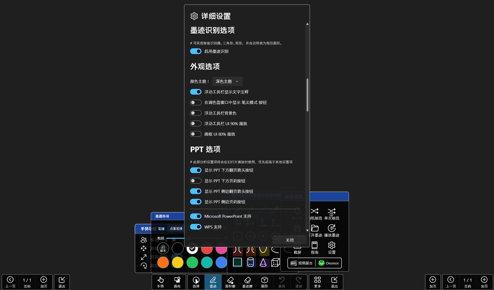

# Ink Canvas DeepRethink

## 👀 前言
使用和分发本软件前，请您应当且务必知晓相关开源协议，本软件基于 https://github.com/InkCanvas/Ink-Canvas-Artistry 和 https://github.com/WXRIW/Ink-Canvas 修改而成。对于墨迹功能的相关 issue 提出，可以优先查阅 https://github.com/WXRIW/Ink-Canvas/issues 。
本软件部分内容使用了 Vibe Coding 编程方式。

## 🔧 特性
Support Active Pen (支持压感)

## ⚠️ 提示
- 对新功能的有效意见和合理建议，开发者会适时回复并进行开发。本软件并非商业性质软件，请勿催促开发者，耐心才能让功能更少 BUG、更加稳定。

> 等待是人类的一种智慧

## 📗 FAQ

### 点击放映后一翻页就闪退？
考虑是由于`Microsoft Office`未激活导致的，请自行激活

### 放映后画板程序不会切换到PPT模式？
如果你曾经安装过`WPS`且在卸载后发现此问题则是由于暂时未确定的问题所导致，可以尝试重新安装WPS
> “您好，关于您反馈的情况我们已经反馈技术同学进一步分析哈，辛苦您可以留意后续WPS版本更新哈~” --回复自WPS客服

另外，处在保护（只读）模式的PPT不会被识别

若因安装了最新版本的 WPS 而导致无法在 WPS 软件内进入 PPT 模式，可以尝试卸载 WPS 后，并清除电脑垃圾、注册表垃圾、删除电脑上所有带 "kingsoft" 名称的文件夹，重新安装 WPS 2021 后，（以上步骤可能有多余步骤），经测试在 WPS 内可以正常进入 PPT 模式。

### **安装后**程序无法正常启动？
请检查你的电脑上是否安装了 `.Net Framework 4.7.2` 或更高版本。若没有，请前往官网下载 [.Net 4.7.2](https://dotnet.microsoft.com/en-us/download/dotnet-framework/thank-you/net472-offline-installer)
。如果仍无法运行，请检查你的电脑上是否安装了 `Microsoft Office`。若没有，请安装后重试

### 我该在何处提出功能需求和错误报告？
请前往该项目的 GitHub Issues 提出。